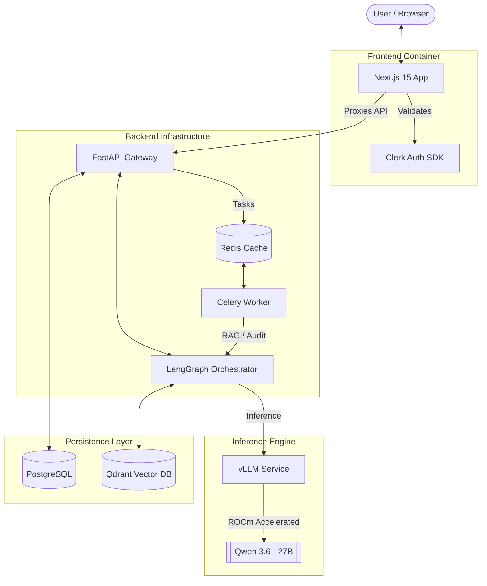

# 🏰 Fortress AI

**Fortress AI** is a private, high-performance, multi-agent legal audit system designed to run on **AMD MI300X** servers. It leverages the latest in ROCm-accelerated inference to provide a secure "Command Center" for complex legal document analysis.

---

## 🚀 Key Features

- **Unified Qwen Pipeline**: Orchestrated via LangGraph, utilizing **Qwen-3.6** for structured extraction, risk analysis, and report synthesis.
- **Hardware-Aware Design**: Optimized for ROCm 7.x and AMD MI300X clusters via vLLM.
- **High-Density RAG**: Integrated **Qdrant** vector database for multilingual legal context.
- **Enterprise Auth**: Secure user management and SSO via **Clerk**.
- **Live Streaming**: Real-time audit reports via Server-Sent Events (SSE).
- **Asynchronous Processing**: Background tasks powered by **Celery** and **Redis**.
- **Advanced PDF Parsing**: **PyMuPDF**-powered extraction with layout-aware text, header detection, and table capture.

---

## 🛠 Tech Stack

### Backend
- **Framework**: FastAPI (Async)
- **Orchestration**: LangGraph (Multi-agent DAG)
- **Inference**: vLLM (OpenAI-compatible)
- **Database**: PostgreSQL (Prisma ORM) & Qdrant (Vector DB)
- **Task Queue**: Celery & Redis

### Frontend
- **Framework**: Next.js 15 (App Router)
- **Auth**: Clerk Next.js SDK
- **Styling**: Tailwind CSS v4 & shadcn/ui
- **Animations**: Framer Motion

---

## 📐 Architecture

Fortress AI utilizes a distributed, containerized architecture optimized for low-latency inference and high-fidelity legal analysis.

### 🧠 The Audit Pipeline
The system follows a 4-node "Chain of Thought" process orchestrated by **LangGraph**:

1.  🔍 **Extraction Node**: Converts unstructured PDFs/Docs into clean legal primitives (parties, dates, clauses).
2.  📚 **Research Node**: Performs semantic search against the **Qdrant** store for precedents and statutory context.
3.  ⚠️ **Risk Node**: Cross-references clauses against a risk matrix to identify liabilities and red flags.
4.  📝 **Reporter Node**: Synthesizes the analysis into a professional, human-readable audit report via SSE.

---

## 🛡 License
Private / Proprietary — All rights reserved.
